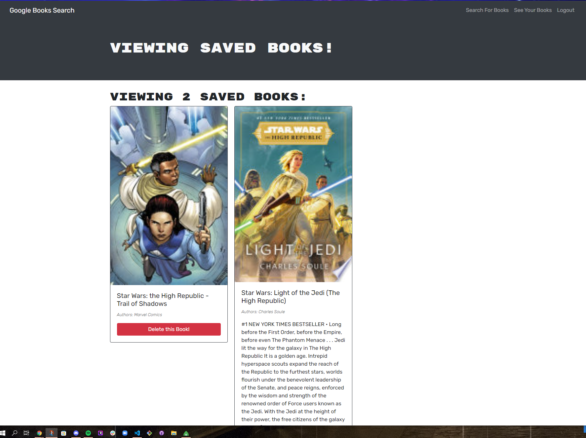
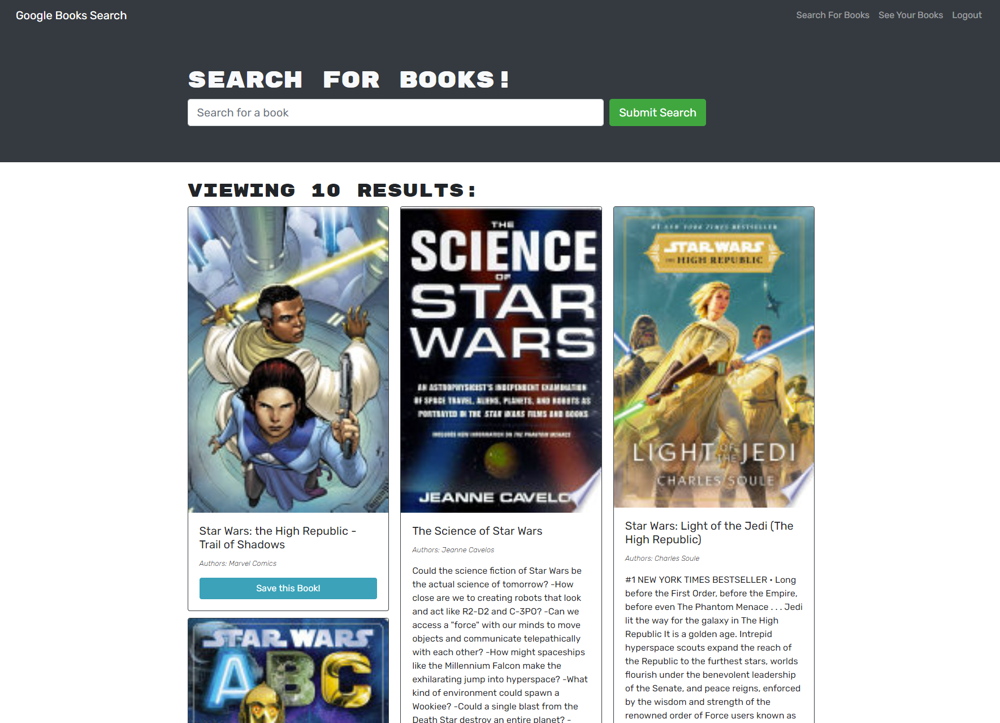

# 21 MERN: Book Search Engine

This week, you’ll take a fully functioning Google Books API search engine built with a RESTful API, and refactor it to be a GraphQL API built with Apollo Server. 
The app was built using the MERN stack, with a React front end, MongoDB database, and Node.js/Express.js server and API. 
It's already set up to allow users to save book searches to the back end. 

## steps

* cloned and organized starter code
* installed apollo and graphql on server side
* Updated Utils/Auth to handle graphQl
* Updated server/server.js to connect to Apollo server as well as GraphQl
* Created the typeDefs file for all the query and mutations
* created resolvers file and used the typeDefs to define the proper resolvers needed
* installed apollo and graphql on client side
* created me query and mutations
* updated the App.js file to work with Apollo server and graphql database
* fixed the Seachbooks.js functionality to use graphQl
* same with Savedbooks.js as well
* in Signupfirm.js replaced the adduser functionality with the mutation ADD_USER
* did same in Loginform but for logging in
* checked for errors and corrected them
* deployed to heroku

## Screenshots

## Links

GitHub: https://github.com/ToiletTakos/book-search-engine
Heroku: https://cryptic-reaches-15352.herokuapp.com/
